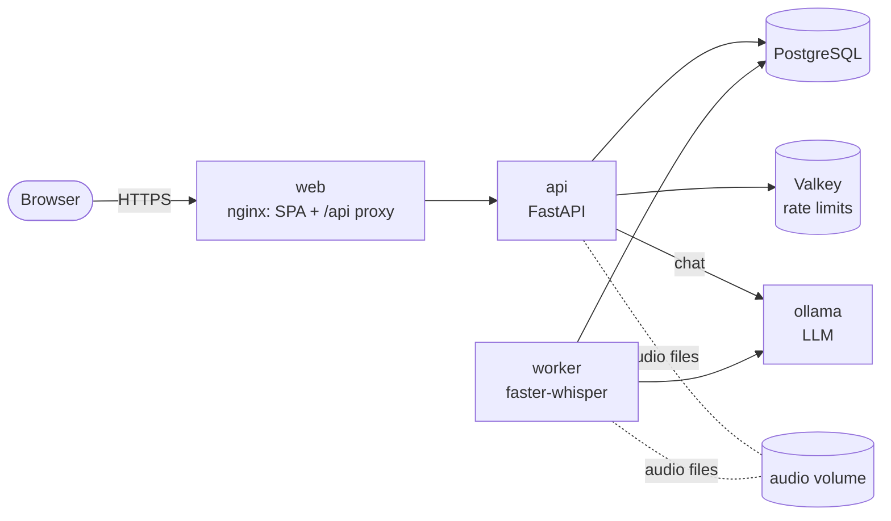

# Sonora — TranscriptionTool

**"From what was said."**
Sonora turns recordings of lectures, trainings and coaching sessions into a recap script, an
interactive quiz, a chat you can ask about the session, and a transcript — shareable with
participants via link, no account required.

- **Record or upload**: record in the browser (any modern browser) or upload an existing audio file.
- **Self-hosted AI**: speech-to-text with [faster-whisper](https://github.com/SYSTRAN/faster-whisper)
  and text generation with a local LLM via [Ollama](https://ollama.com). No audio or transcript
  leaves your servers.
- **Grounded output**: every takeaway and quiz answer points to a timestamp in the transcript;
  the chat answers from the lecture first and says when it falls back to general knowledge.
- **Sharing**: revocable, expiring participant links that expose only the tabs you choose.
- **Accounts**: self-registration, profile, monthly plan quotas, activity log, account deletion.

---

## Architecture



The API stores uploads and queues a job; the **worker** transcribes the audio, asks the LLM
for the recap and quiz, and stores the results. The browser polls the session status.
Details: [docs/ARCHITECTURE.md](docs/ARCHITECTURE.md).

| Layer | Technology |
|---|---|
| Frontend | React 19, Vite 8, plain CSS (no UI framework), Vitest |
| API | Python 3.13, FastAPI, Pydantic v2, SQLAlchemy 2 (async), Alembic |
| Database | PostgreSQL 17 (Docker) · SQLite (local development) |
| Speech-to-text | faster-whisper (CTranslate2), GPU or CPU |
| LLM | Ollama — `gemma3:12b` by default in Docker, `llama3.2:3b` for local development |
| Rate limiting | `limits` with Valkey (Docker) or in-memory (local) |
| Delivery | Docker Compose, nginx, optional Caddy for automatic HTTPS |

## Repository layout

```
TranscriptionTool/
├── Backend/                 # FastAPI app, worker, CLI, migrations, tests → Backend/README.md
├── Frontend/                # React SPA + nginx image                    → Frontend/README.md
├── deploy/Caddyfile         # TLS termination (docker-compose.tls.yml)
├── docs/                    # Architecture, security, deployment
├── docker-compose.yml       # Production stack (+ .gpu.yml / .tls.yml overrides)
├── .env.example             # Docker Compose configuration template
└── .github/workflows/ci.yml # Lint, type-check, tests, image builds
```

## Quick start (local development, no Docker)

Prerequisites: Python 3.12+ with [uv](https://docs.astral.sh/uv/), Node.js 22+, and
[Ollama](https://ollama.com) with a model pulled (`ollama pull llama3.2:3b`).

```bash
# 1. Backend (http://127.0.0.1:8000)
cd Backend
uv sync --extra transcription
cp .env.example .env                     # SQLite, local Ollama, embedded worker
uv run alembic upgrade head
uv run python -m sonora.cli seed-demo    # optional: demo trainer + 4 sample sessions
uv run uvicorn sonora.main:create_app --factory --reload

# 2. Frontend (http://localhost:5173) — in a second terminal
cd Frontend
npm install
npm run dev
```

Open <http://localhost:5173>, register an account or use the **Demo-Account** button
(`marie.trainer@example.com` / `sonora-demo-2026`, created by `seed-demo`).

> **Transcription in development.** `Backend/.env.example` uses the *fake* transcriber, which
> returns a sample transcript for every upload so the whole pipeline works without a speech
> model. For real transcription, set `SONORA_TRANSCRIPTION_BACKEND=faster-whisper`; the model is
> downloaded from Hugging Face on first use, or point `SONORA_WHISPER_MODEL` at a local model
> folder (see [Backend/README.md](Backend/README.md#speech-to-text-models)).

## Production (Docker)

```bash
cp .env.example .env        # set PUBLIC_HOST, PUBLIC_ORIGIN, POSTGRES_PASSWORD, models
docker compose -f docker-compose.yml -f docker-compose.gpu.yml -f docker-compose.tls.yml up -d --build
```

Prerequisites, GPU sizing, TLS, backups and upgrades: [docs/DEPLOYMENT.md](docs/DEPLOYMENT.md).

## Tests and quality checks

```bash
cd Backend  && uv run pytest --cov           # ~350 tests, ≥ 90 % branch coverage enforced (currently ~99 %)
cd Backend  && uv run ruff check . && uv run mypy
cd Backend  && uv run pytest -m integration  # against a running Ollama (optional)
cd Frontend && npm test && npm run lint && npm run build
```

CI runs all of the above and builds the Docker images on every push and pull request.

## Security

Sonora is built to production standards: Argon2id passwords, server-side sessions in
`HttpOnly`/`Secure`/`SameSite=Strict` cookies, CSRF tokens plus origin checks, strict
per-user authorization, rate limiting and lockouts, validated uploads, strict CSP and
security headers, hardened containers, and data minimisation (audio is deleted after
transcription). The full model, known limitations and a production checklist:
[docs/SECURITY.md](docs/SECURITY.md).

## Documentation

| Document | Contents |
|---|---|
| [Backend/README.md](Backend/README.md) | Backend development, configuration, API reference, CLI, testing |
| [Frontend/README.md](Frontend/README.md) | Frontend structure, API client, environment variables, testing |
| [docs/ARCHITECTURE.md](docs/ARCHITECTURE.md) | Components, data model, processing pipeline, design decisions |
| [docs/SECURITY.md](docs/SECURITY.md) | Threat model, security controls, known gaps, production checklist |
| [docs/DEPLOYMENT.md](docs/DEPLOYMENT.md) | Docker deployment, GPU, TLS, operations, troubleshooting |
