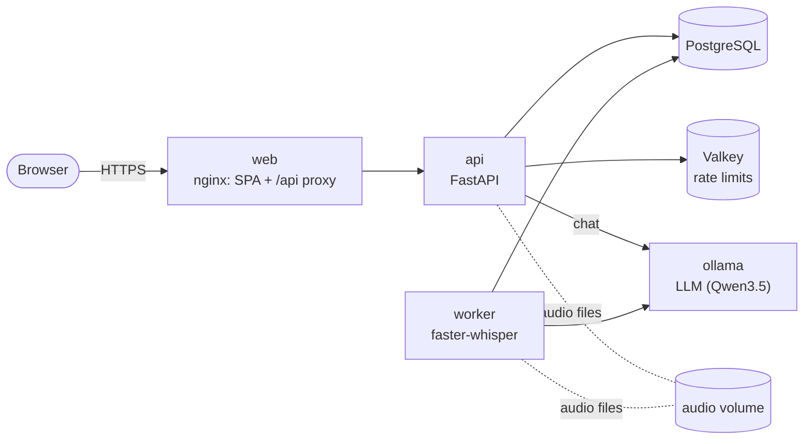

# Sonora — TranscriptionTool

**"From what was said."**
Sonora turns recordings of lectures, trainings and coaching sessions into a recap script, an
interactive quiz, a chat you can ask about the session, and a transcript — shareable with
listeners via link or QR code, no account required. Listeners can give anonymous feedback,
and the lecturer sees how the quiz went and gets an analysis of their own lecture.

- **Record or upload**: record in the browser (any modern browser) or upload an existing audio file.
- **Self-hosted AI**: speech-to-text with [faster-whisper](https://github.com/SYSTRAN/faster-whisper)
  and text generation with a local LLM (Qwen3.5-9B by default) via [Ollama](https://ollama.com).
  No audio or transcript leaves your servers.
- **Grounded output**: every takeaway and quiz answer points to a timestamp in the transcript;
  the chat answers from the lecture first, says when it falls back to general knowledge and
  declines requests unrelated to the lecture.
- **Sharing**: revocable, expiring links (and QR codes) that expose only the tabs you choose:
  script, quiz, chatbot, transcript, feedback form.
- **Chat for listeners**: listeners can ask the chatbot too. Their conversations aren't
  stored, and limits per listener and per lecture, plus a cap on answers generated at once,
  keep the GPU free for processing.
- **Listener feedback**: a short anonymous form (ratings + one open question), once per
  device; the lecturer sees the answer shares and all comments.
- **Quiz statistics**: each listener's first attempt is counted anonymously; the lecturer
  sees per question how often each option was chosen.
- **Lecture analysis** (lecturer only): content, rhetoric and structure scored 1–10 on a
  radar chart with reasons and tips, plus the time spent on each topic and the speaking pace.
- **Accounts and plans**: self-registration with a free plan (one session a month, recordings
  up to 60 minutes), Trainer/Pro plans bought through a simulated checkout (no real payments),
  profile, monthly quotas, payment history, account deletion.

---

## Architecture


```mermaid
flowchart LR
    browser([Browser]) -->|HTTPS| web["web<br/>nginx: SPA + /api proxy"]
    web --> api["api<br/>FastAPI"]
    api --> db[(PostgreSQL)]
    api --> valkey[(Valkey<br/>rate limits)]
    api -->|chat| ollama["ollama<br/>LLM (Qwen3.5)"]
    api -. audio files .- vol[(audio volume)]
    worker["worker<br/>faster-whisper"] --> db
    worker --> ollama
    worker -. audio files .- vol
```

The API stores uploads and queues a job; the **worker** transcribes the audio, asks the LLM
for the recap and quiz, and stores the results; a second job then writes the lecture
analysis. The browser polls the session status.
Details: [docs/ARCHITECTURE.md](docs/ARCHITECTURE.md).

| Layer | Technology |
|---|---|
| Frontend | React 19, Vite 8, plain CSS (no UI framework), Vitest |
| API | Python 3.13, FastAPI, Pydantic v2, SQLAlchemy 2 (async), Alembic |
| Database | PostgreSQL 17 (Docker) · SQLite (local development) |
| Speech-to-text | faster-whisper (CTranslate2), GPU or CPU |
| LLM | Ollama — `qwen3.5:9b` (Qwen3.5-9B) by default; prompts and sampling in [docs/LLM.md](docs/LLM.md) |
| Rate limiting | `limits` with Valkey (Docker) or in-memory (local) |
| Delivery | Docker Compose, nginx, optional Caddy for automatic HTTPS |

## Repository layout

```
TranscriptionTool/
├── Backend/                 # FastAPI app, worker, CLI, migrations, tests → Backend/README.md
├── Frontend/                # React SPA + nginx image                    → Frontend/README.md
├── deploy/Caddyfile         # TLS termination (docker-compose.tls.yml)
├── docs/                    # Architecture, security, deployment
├── docker-compose.yml       # Production stack (+ .gpu.yml / .tls.yml overrides)
├── .env.example             # Docker Compose configuration template
└── .github/workflows/ci.yml # Lint, type-check, tests, image builds
```

## Quick start (local development, no Docker)

Prerequisites: Python 3.12+ with [uv](https://docs.astral.sh/uv/), Node.js 22+, and
[Ollama](https://ollama.com) with the model pulled (`ollama pull qwen3.5:9b`, 6.6 GB; a GPU
with 8 GB or more is recommended).

```bash
# 1. Backend (http://127.0.0.1:8000)
cd Backend
uv sync --extra transcription
cp .env.example .env                     # SQLite, local Ollama, embedded worker
uv run alembic upgrade head
uv run python -m sonora.cli seed-demo    # optional: demo trainer + 4 sample sessions
uv run uvicorn sonora.main:create_app --factory --reload

# 2. Frontend (http://localhost:5173) — in a second terminal
cd Frontend
npm install
npm run dev
```

Open <http://localhost:5173>, register an account or use the **Use demo account** button
(`marie.trainer@example.com` / `sonora-demo-2026`, created by `seed-demo`). New accounts
start on the Free plan (one session a month). For more, pick Trainer or Pro and pay with a
test card such as `4242 4242 4242 4242` (any future expiry, any CVC) — payments are
simulated, nothing is charged.

> **Transcription in development.** `Backend/.env.example` uses the *fake* transcriber, which
> returns a sample transcript for every upload so the whole pipeline works without a speech
> model. For real transcription, set `SONORA_TRANSCRIPTION_BACKEND=faster-whisper`; the model is
> downloaded from Hugging Face on first use, or point `SONORA_WHISPER_MODEL` at a local model
> folder (see [Backend/README.md](Backend/README.md#speech-to-text-models)).

### Testing share links as a listener

The share page recognises the trainer by the sign-in cookie, which every tab and window of the
same browser sends. Opened there, it says "This is your own share link", and your quiz answers
and feedback aren't counted (the chat works, under your own chat limits). To test as a
listener, open the link in a **private window**
(Chrome/Edge: Ctrl+Shift+N, Firefox: Ctrl+Shift+P) or in **another browser**.

Each browser also counts as one listener: one feedback response and one counted quiz attempt
(the first). For several test listeners, use several browsers or browser profiles, or close all
private windows between two listeners, which clears their cookies.

To see how the results hold up with many listeners, let the CLI add simulated ones to a share
link (feedback with random ratings and comments, and a first quiz attempt each; not in
production). Copy the link from the share dialog:

```bash
cd Backend && uv run python -m sonora.cli seed-feedback --link http://localhost:5173/share/<token> --count 500
# Docker stack on your machine (it runs in production mode, hence --force; never on a real server):
docker compose exec api python -m sonora.cli seed-feedback --link http://localhost:8080/share/<token> --count 500 --force
```

A session stores at most 5,000 feedback responses and 5,000 quiz attempts; the command stops
adding feedback there.

## Production (Docker)

```bash
cp .env.example .env        # set PUBLIC_HOST, PUBLIC_ORIGIN, POSTGRES_PASSWORD, models
docker compose -f docker-compose.yml -f docker-compose.gpu.yml -f docker-compose.tls.yml up -d --build
```

Prerequisites, GPU sizing, TLS, backups and upgrades: [docs/DEPLOYMENT.md](docs/DEPLOYMENT.md).

## Tests and quality checks

```bash
cd Backend  && uv run pytest --cov           # ~480 tests, ≥ 90 % branch coverage enforced (currently ~99 %)
cd Backend  && uv run ruff check . && uv run mypy
cd Backend  && uv run pytest -m integration  # against a running Ollama with qwen3.5:9b (optional)
cd Frontend && npm run test:coverage && npm run lint && npm run build   # ~170 tests, coverage thresholds enforced
```

CI runs all of the above and builds the Docker images on every push and pull request.

## Security

Sonora is built to production standards: Argon2id passwords, server-side sessions in
`HttpOnly`/`Secure`/`SameSite=Strict` cookies, CSRF tokens plus origin checks, strict
per-user authorization, rate limiting and lockouts, validated uploads, strict CSP and
security headers, hardened containers, and data minimisation (audio is deleted after
transcription; listeners are known only by a per-session hash of a random cookie). Prices
are set by the server, plans are granted only by a successful checkout, and card details
never reach the server. The full model, known limitations and a production checklist:
[docs/SECURITY.md](docs/SECURITY.md).

> **Payments are simulated.** The checkout accepts test cards only and moves no money, in
> every environment: anyone can activate a paid plan for free until a real payment
> provider is connected (see SECURITY.md, *Known limitations*).

## Documentation

| Document | Contents |
|---|---|
| [Backend/README.md](Backend/README.md) | Backend development, configuration, API reference, CLI, testing |
| [Frontend/README.md](Frontend/README.md) | Frontend structure, API client, environment variables, testing |
| [docs/ARCHITECTURE.md](docs/ARCHITECTURE.md) | Components, data model, processing pipeline, design decisions |
| [docs/LLM.md](docs/LLM.md) | Model, prompts, sampling, measured decisions, switching models |
| [docs/SECURITY.md](docs/SECURITY.md) | Threat model, security controls, known gaps, production checklist |
| [docs/DEPLOYMENT.md](docs/DEPLOYMENT.md) | Docker deployment, GPU, TLS, operations, troubleshooting |
| [CHANGELOG.md](CHANGELOG.md) | What changed, release by release |
