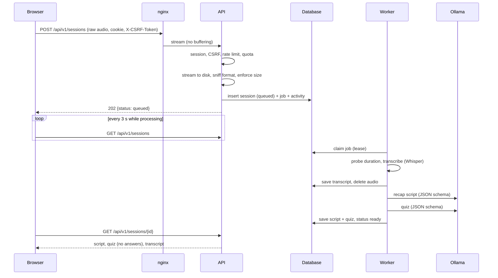
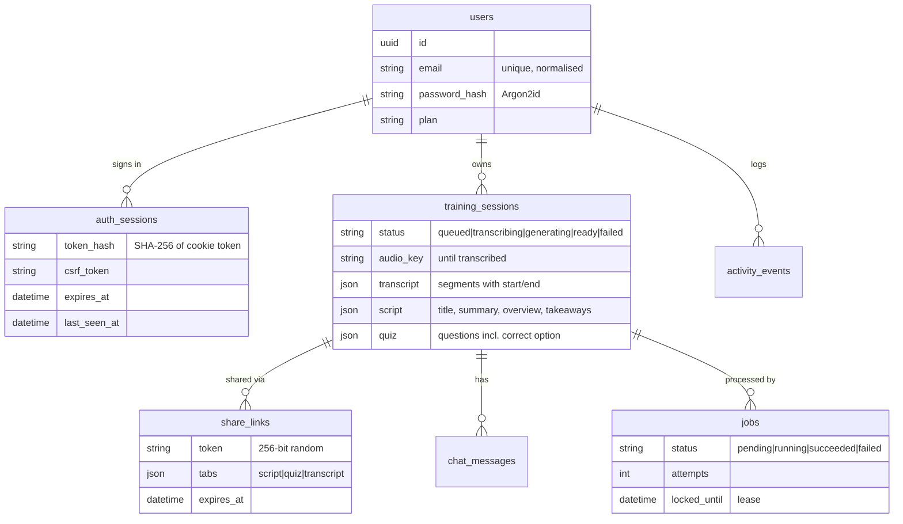

# Architecture

## Components

| Component | Responsibility | Scales by |
|---|---|---|
| **web** (nginx) | Serves the SPA, proxies `/api` to the API, security headers, access log | stateless |
| **api** (FastAPI) | Authentication, sessions, uploads, sharing, chat, quiz grading | `API_WORKERS` processes / replicas |
| **worker** | Transcription (faster-whisper) and recap/quiz generation (LLM) | more worker containers |
| **PostgreSQL** | All state: users, sign-ins, sessions + content, shares, chat, activity, job queue | vertical |
| **Valkey** | Shared rate-limit counters (ephemeral) | — |
| **Ollama** | Serves the LLM for generation (worker) and chat (api) | GPU memory / `OLLAMA_NUM_PARALLEL` |
| **Shared audio volume** | Uploaded recordings until they are transcribed | — |

In local development the api and worker run in one process (`SONORA_WORKER_EMBEDDED=true`),
SQLite replaces PostgreSQL and in-memory rate limiting replaces Valkey.

## Request flow

## Data model

All foreign keys cascade on delete, so deleting a user or a session removes everything that
belongs to it inside the database. All ids are random UUIDs, and all timestamps are UTC.

Generated content (transcript, script, quiz) is stored as JSON documents because it is always
read and written as a whole. These columns are deferred, so list queries never load them by
accident.

## Design decisions

**Server-side sessions instead of JWTs.** Sessions can be revoked immediately (logout,
password change, account deletion), and the token never needs to be readable by JavaScript.
Only a hash of the token is stored, so a copy of the database doesn't give access to accounts.

**One origin for the SPA and the API.** nginx (and Vite in development) proxies `/api`. That
removes CORS entirely and lets the session cookie be `SameSite=Strict` with the `__Host-` prefix.

**A job queue in the database instead of Celery/Redis.** Jobs are rare (a few per trainer per
month) and long (minutes). A `jobs` table claimed with an optimistic `UPDATE` plus a renewable
lease gives at-most-one execution, crash recovery and retries with backoff. It needs no extra
infrastructure and behaves the same on SQLite and PostgreSQL.

**Raw-body uploads.** Dependencies (auth, CSRF, rate limit, quota) run before the body is
read, and the body streams directly to disk. A multipart endpoint would be parsed by the
framework before any of these checks run.

**Whisper in the worker, not the API.** Decoding untrusted media (FFmpeg via PyAV) and running
the model are isolated in a container that has no inbound network access. The API image
doesn't even contain the speech stack.

**Ollama's native API with JSON schemas.** Unlike the OpenAI-compatible endpoint, the native
API lets each call set the context window (`num_ctx`), and `format` constrains decoding to the
schema. Everything above the client depends only on the `LLMClient` protocol, so adding
another provider (vLLM, a hosted API) is a local change.

**Validation after generation.** Constrained decoding guarantees valid JSON, not correct
content. Output is normalised (lengths, duplicates), timestamps are snapped onto real
transcript segments, and invented timestamps are dropped. Quiz options are assembled
server-side from `correct_answer` + `wrong_answers` and shuffled. Small models get option
indices wrong and tend to put the right answer first.

**Map-reduce for long lectures.** When a transcript exceeds the context budget, chunks are
condensed into timestamped notes, and the recap and quiz are written from those notes. Short
lectures go through in one pass, which gives the best quality.

**BM25 retrieval for the chat.** If the whole transcript fits, the model sees all of it.
Otherwise the most relevant passages are selected with BM25, so no embedding model or vector
database is needed. It works for German and English alike.

**Server-side quiz grading.** Participants never receive the answer key before they answer.
This also makes it possible to record attempts later ("proof it landed" reports).

**Share tokens stored in plain text.** A share token only unlocks content stored in the same
database, so hashing it would protect nothing. Storing it lets trainers copy an existing link
again. Session tokens are different: they grant account access, so they are hashed.

**Quota from the activity log.** Monthly usage counts `session_created` events, so deleting a
session doesn't give back processing that was already spent.

## Frontend

A React SPA without a router library (views are state, plus `/share/<token>` for
participants), and a small `api.js` client. It keeps no server data in global state: each view
loads what it shows, and the app shell polls while sessions are processing.
See [Frontend/README.md](../Frontend/README.md).

## Not implemented yet

Speaker diarization (every segment is labelled "Speaker"), the recap video (the tab is a
design mock behind `VITE_FEATURE_VIDEO`), web search in the chat (the "web" source), email
delivery (verification, password reset, "session ready" notifications — the preference is
stored), billing, and quiz attempt analytics.
