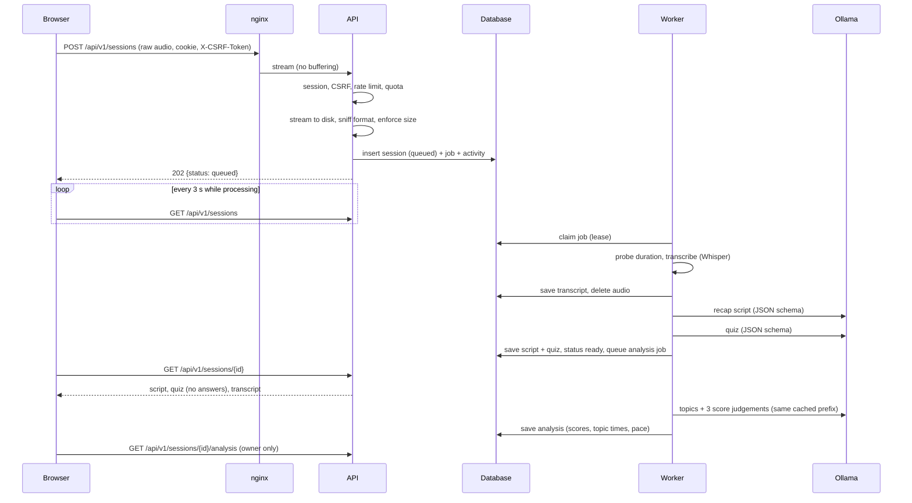
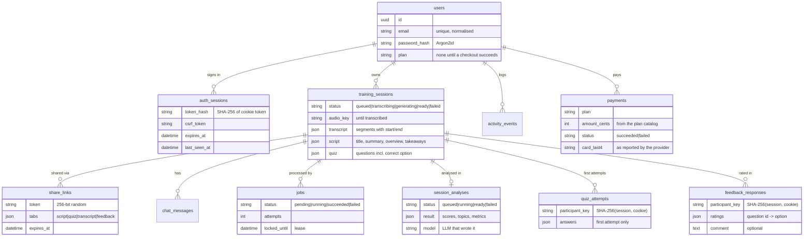

# Architecture

## Components

| Component | Responsibility | Scales by |
|---|---|---|
| **web** (nginx) | Serves the SPA, proxies `/api` to the API, security headers, access log | stateless |
| **api** (FastAPI) | Authentication, sessions, uploads, sharing, chat (owner and listeners), quiz grading, listener feedback, plans and (simulated) payments | `API_WORKERS` processes / replicas |
| **worker** | Transcription (faster-whisper), recap/quiz generation and lecture analysis (LLM) | more worker containers |
| **PostgreSQL** | All state: users, sign-ins, payments, sessions + content, analyses, shares, quiz attempts, feedback, the owner's chat (listeners' chats aren't stored), activity, job queue | vertical |
| **Valkey** | Shared rate-limit counters (ephemeral) | — |
| **Ollama** | Serves the LLM for generation (worker) and chat (api) | GPU memory / `OLLAMA_NUM_PARALLEL` |
| **Shared audio volume** | Uploaded recordings until they are transcribed | — |

In local development the api and worker run in one process (`SONORA_WORKER_EMBEDDED=true`),
SQLite replaces PostgreSQL and in-memory rate limiting replaces Valkey.

## Request flow

```mermaid
sequenceDiagram
    participant B as Browser
    participant W as nginx
    participant A as API
    participant D as Database
    participant Q as Worker
    participant L as Ollama

    B->>W: POST /api/v1/sessions (raw audio, cookie, X-CSRF-Token)
    W->>A: stream (no buffering)
    A->>A: session, CSRF, rate limit, quota
    A->>A: stream to disk, sniff format, enforce size
    A->>D: insert session (queued) + job + activity
    A-->>B: 202 {status: queued}
    loop every 3 s while processing
        B->>A: GET /api/v1/sessions
    end
    Q->>D: claim job (lease)
    Q->>Q: probe duration, transcribe (Whisper)
    Q->>D: save transcript, delete audio
    Q->>L: recap script (JSON schema)
    Q->>L: quiz (JSON schema)
    Q->>D: save script + quiz, status ready, queue analysis job
    B->>A: GET /api/v1/sessions/{id}
    A-->>B: script, quiz (no answers), transcript
    Q->>L: topics + 3 score judgements (same cached prefix)
    Q->>D: save analysis (scores, topic times, pace)
    B->>A: GET /api/v1/sessions/{id}/analysis (owner only)
```

## Data model

```mermaid
erDiagram
    users ||--o{ auth_sessions : "signs in"
    users ||--o{ training_sessions : owns
    users ||--o{ activity_events : logs
    users ||--o{ payments : "pays"
    training_sessions ||--o{ share_links : "shared via"
    training_sessions ||--o{ chat_messages : has
    training_sessions ||--o{ jobs : "processed by"
    training_sessions ||--o| session_analyses : "analysed in"
    training_sessions ||--o{ quiz_attempts : "first attempts"
    training_sessions ||--o{ feedback_responses : "rated in"

    users {
        uuid id
        string email "unique, normalised"
        string password_hash "Argon2id"
        string plan "none until a checkout succeeds"
    }
    payments {
        string plan
        int amount_cents "from the plan catalog"
        string status "succeeded|failed"
        string card_last4 "as reported by the provider"
    }
    auth_sessions {
        string token_hash "SHA-256 of cookie token"
        string csrf_token
        datetime expires_at
        datetime last_seen_at
    }
    training_sessions {
        string status "queued|transcribing|generating|ready|failed"
        string audio_key "until transcribed"
        json transcript "segments with start/end"
        json script "title, summary, overview, takeaways"
        json quiz "questions incl. correct option"
    }
    share_links {
        string token "256-bit random"
        json tabs "script|quiz|transcript|feedback"
        datetime expires_at
    }
    session_analyses {
        string status "queued|running|ready|failed"
        json result "scores, topics, metrics"
        string model "LLM that wrote it"
    }
    quiz_attempts {
        string participant_key "SHA-256(session, cookie)"
        json answers "first attempt only"
    }
    feedback_responses {
        string participant_key "SHA-256(session, cookie)"
        json ratings "question id -> option"
        text comment "optional"
    }
    jobs {
        string status "pending|running|succeeded|failed"
        int attempts
        datetime locked_until "lease"
    }
```

All foreign keys cascade on delete, so deleting a user or a session removes everything that
belongs to it inside the database. All ids are random UUIDs, and all timestamps are UTC.

Generated content (transcript, script, quiz) is stored as JSON documents because it is always
read and written as a whole. These columns are deferred, so list queries never load them by
accident.

## Design decisions

**Server-side sessions instead of JWTs.** Sessions can be revoked immediately (logout,
password change, account deletion), and the token never needs to be readable by JavaScript.
Only a hash of the token is stored, so a copy of the database doesn't give access to accounts.

**One origin for the SPA and the API.** nginx (and Vite in development) proxies `/api`. That
removes CORS entirely and lets the session cookie be `SameSite=Strict` with the `__Host-` prefix.

**A job queue in the database instead of Celery/Redis.** Jobs are rare (a few per trainer per
month) and long (minutes). A `jobs` table claimed with an optimistic `UPDATE` plus a renewable
lease gives at-most-one execution, crash recovery and retries with backoff. It needs no extra
infrastructure and behaves the same on SQLite and PostgreSQL.

**Raw-body uploads.** Dependencies (auth, CSRF, rate limit, quota) run before the body is
read, and the body streams directly to disk. A multipart endpoint would be parsed by the
framework before any of these checks run.

**Whisper in the worker, not the API.** Decoding untrusted media (FFmpeg via PyAV) and running
the model are isolated in a container that has no inbound network access. The API image
doesn't even contain the speech stack.

**Ollama's native API with JSON schemas.** Unlike the OpenAI-compatible endpoint, the native
API lets each call set the context window (`num_ctx`), and `format` constrains decoding to the
schema. Everything above the client depends only on the `LLMClient` protocol, so adding
another provider (vLLM, a hosted API) is a local change.

**Validation after generation.** Constrained decoding guarantees valid JSON, not correct
content. Output is normalised (lengths, duplicates), timestamps are snapped onto real
transcript segments, and invented timestamps are dropped. Quiz options are assembled
server-side from `correct_answer` + `wrong_answers` and shuffled. Small models get option
indices wrong and tend to put the right answer first.

**Map-reduce for long lectures.** When a transcript exceeds the context budget, chunks are
condensed into timestamped notes, and the recap and quiz are written from those notes. Short
lectures go through in one pass, which gives the best quality.

**BM25 retrieval for the chat.** If the whole transcript fits, the model sees all of it.
Otherwise the most relevant passages are selected with BM25, so no embedding model or vector
database is needed. It works for German and English alike.

**A stateless chat for listeners.** Listeners on a link that shares the chat use the same
assistant as the owner, but nothing they ask is stored: the page keeps the conversation and
sends its last six turns with each question (user and assistant turns only, length-limited).
Each answer costs GPU time that processing and the owner's chat need too. Besides limits per
listener, IP and lecture, each API process therefore generates at most four listener answers
at once (`PUBLIC_CHAT_CONCURRENCY`). Further questions get `503 assistant_busy` straight away
instead of queueing in Ollama ahead of a lecture that is being processed. The prompt keeps the
assistant to the lecture's subject (see [LLM.md](LLM.md)). The owner can try the chat on their
own link under their usual chat limits.

**Server-side quiz grading.** Participants never receive the answer key before they answer.
This also makes it possible to record attempts later ("proof it landed" reports).

**Share tokens stored in plain text.** A share token only unlocks content stored in the same
database, so hashing it would protect nothing. Storing it lets trainers copy an existing link
again. Session tokens are different: they grant account access, so they are hashed.

**Quota from the activity log.** Monthly usage counts `session_created` events, so deleting a
session doesn't give back processing that was already spent (cancelling and re-buying a plan
doesn't reset it either).

**Plans are granted by the checkout, never chosen at sign-up.** Self-registered accounts start
on the `none` plan (no uploads). `POST /billing/checkout` charges the price from the server's
plan catalog through a `PaymentProvider`; only on success does the account get the plan. The
browser sends the provider's one-time token, never card details, like with real card
processors. The only provider today is a simulation (`MockPaymentProvider`) that accepts
Stripe-style test tokens; a real one plugs in behind the same protocol (it will need
webhooks and idempotency keys, see SECURITY.md).

**Anonymous listeners, counted once.** Share pages with a quiz, feedback form or chat set a
random 256-bit participant cookie (`HttpOnly`, `SameSite=Strict`, `__Host-`); the chat uses it
only for its per-listener limits. The server only
stores `SHA-256(session id + cookie)`, so a browser's answers in one session can't be linked
to its answers in another, and a unique constraint per session makes "first quiz attempt"
and "one feedback per listener" hold under races. The signed-in owner is recognised on their
own link and never counted. Clearing cookies allows another response — acceptable for
anonymous feedback; the rate limits and a per-session cap bound abuse.

**One feedback form, defined on the server.** `sonora/feedback.py` defines the questions
(star rating, two 7-point scales, a three-way choice and one optional comment). The share
page renders what the server sends, the server validates against the same definition and
the results use the same labels. Responses store the form version.

**Lecture analysis as its own job.** When processing finishes, the session becomes ready and
an `analyze_session` job is queued in the same commit. Script and quiz are never held back by
the slower analysis, and a failed analysis has its own status and retry without touching the
session. Each job type has a failure hook, so an abandoned analysis job can't fail a
session that is already ready. Sessions from before the feature can request an analysis.

**The model judges, the code measures.** The analysis asks the LLM only for what needs
judgement: per category an assessment, a 1–10 score and a tip (the median of three
independent judgements), and the start timestamp of each topic. Topic starts are snapped
onto real segments; durations, time shares and the speaking pace (words per minute) are
computed from the transcript. See [LLM.md](LLM.md) for the measurements behind the settings.

**One prompt prefix per lecture.** All tasks on a lecture use the same system prompt and put
the transcript before the task, so the model server reads the transcript once and serves the
other tasks from its cache.

## Frontend

A React SPA without a router library (views are state, plus `/share/<token>` for
participants), and a small `api.js` client. It keeps no server data in global state: each view
loads what it shows, and the app shell polls while sessions are processing.
See [Frontend/README.md](../Frontend/README.md).

## Not implemented yet

Speaker diarization (every segment is labelled "Speaker"), the recap video (the tab is a
design mock behind `VITE_FEATURE_VIDEO`), web search in the chat (the "web" source), email
delivery (verification, password reset, "session ready" notifications — the preference is
stored) and a real payment provider (recurring billing, renewals, invoices, prorating).
